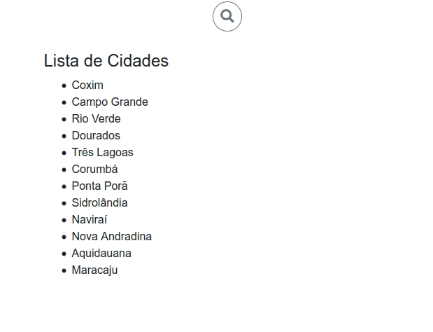

# Componentes Vue
Estudos de criação de componentes pequenos e simples utilizando VueJS

## Instalação
```sh
npm install
```

## Rodando o projeto
```sh
npm run serve
```

## Lista de Componentes
* [Input de busca](src/components/search-form/)



## Histórico de lançamentos
* 0.0.1 - Search form
